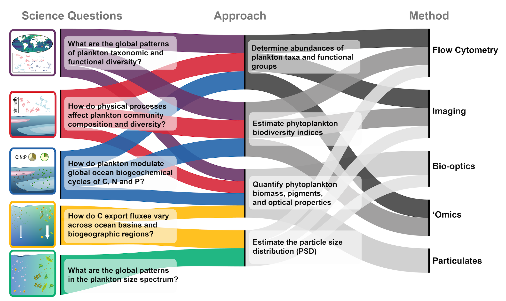

---
title: Bio-GO-SHIP
summary: Linking marine biodiversity and biogeochemistry. Bio-GO-SHIP is a ocean observing program that will incorporate sustained and consistent global biological ocean observations into the Global Ocean Ship-based Hydrographic Investigations Program (GO-SHIP).
tags:
  - biological oceanography
  - plankton
  - ocean observing
  - biodiversity
  - biogeography
date: "2022-02-26"

---
[Bio-GO-SHIP](https://biogoship.org/), a new ocean observing program that will incorporate sustained and consistent global biological ocean observations into the Global Ocean Ship-based Hydrographic Investigations Program (GO-SHIP). The goal of Bio-GO-SHIP is to produce systematic and consistent biological observations during global ocean repeat hydrographic surveys, with a particular focus on the planktonic ecosystem. Ocean plankton are an essential component of the earth climate system, form the base of the oceanic food web and thereby play an important role in influencing food security and contributing to the Blue Economy. Despite its importance, ocean biology is largely under-sampled in time and space compared to physical and chemical properties. This lack of information hampers our ability to understand the role of plankton in regulating biogeochemical processes and fueling higher trophic levels, now and in future ocean conditions. 

Traditionally, many of the methods used to quantify biological and ecosystem essential ocean variables (EOVs), measures that provide valuable information on the ecosystem, have been expensive and labor- and time-intensive, limiting their large-scale deployment. In the last two decades, new technologies have been developed and matured, making it possible to greatly expand our biological ocean observing capacity. These technologies, including cell imaging, bio-optical sensors and 'omic tools, can be combined to provide overlapping measurements of key biological and ecosystem EOVs. New developments in data management and open sharing can facilitate meaningful synthesis and integration with concurrent physical and chemical data. Here we outline how Bio-GO-SHIP leverages these technological advances to greatly expand our knowledge and understanding of the constituents and function of the global ocean plankton ecosystem.

An [overview of the Bio-GO-SHIP program](https://www.frontiersin.org/articles/10.3389/fmars.2021.767443/full) was recently published in Frontiers in Marine Science.

*This project is funded by NOPP, the National Oceanographic Partnership Program, with support from NOAA and NSF.*
<!---->

