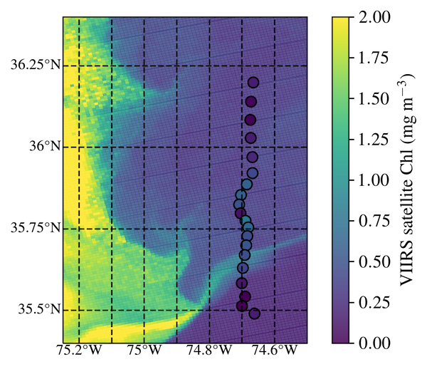

---
title: Productivity and Carbon exchange at the Hatteras Front
summary: Shelfbreak carbon exchange is important for the budget of biogeochemical processes and the global climate. Understanding how water mass convergence and exchange affects the vertical distribution of carbon on short spatial and temporal scales at the shelfbreak helps us estimate fluxes of organic carbon from the shelf to the open ocean that might be missed by sensors on remote sensing platforms.
tags:
  - physical oceanography
  - gliders
  - satellite chlorophyll
  - fronts
date: "2022-02-26"

---
Shelfbreak carbon exchange is important for the budget of biogeochemical processes and the global climate. Understanding how water mass convergence and exchange affects the vertical distribution of carbon on short spatial and temporal scales at the shelfbreak helps us estimate fluxes of organic carbon from the shelf to the open ocean that might be missed by sensors on remote sensing platforms. We study these processes through a combination of in-situ measurements, ocean autonomous gliders, and high-resolution satellite ocean color products. 

Here we show a match-up between surface Chlorohyll estimates from VIIRS, and depth integrated chlorophyll from a glider deployed as part of the [PEACH program](https://sites.google.com/a/ncsu.edu/peach-public-site/).

Currently focused on the shelf-open ocean exchange hotspot off Cape Hatteras, NC, USA, this area is of particular interest because the Mid-Atlantic Bight (MAB), South Atlantic Bight (SAB), and Gulf Stream (GS) waters with very different biogeochemical properties converge and drive cross-shelf export on short time and. space scales. Our goals are to associate chlorophyll distributions with specific hydrographic structures and generate longer timeseries of vertically resolved chlorophyll products by pairing glider data with machine learning and satellite products.

*This project is funded by a Virginia Space Grant Consortium [New Investigator Program](https://vsgc.odu.edu/newinvestigatorprogram/).*

<!---->

